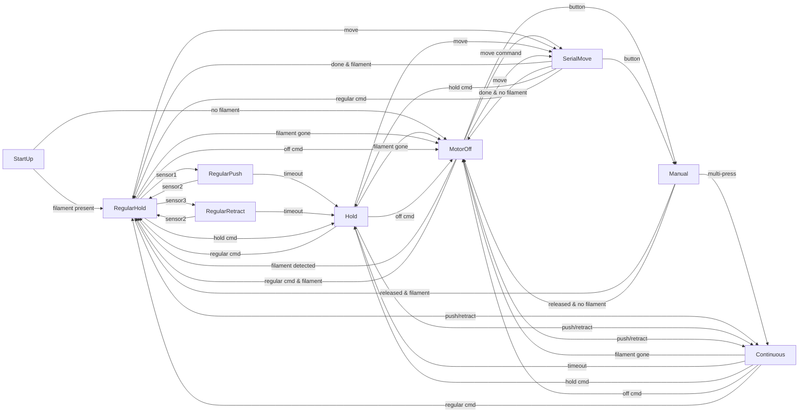

#Buffer Firmware Overview

## Purpose

This firmware controls a filament buffer used between a filament spool and a direct drive extruder. A spring loaded plunger moves along the filament path and activates optical sensors. A stepper motor unwinds or rewinds the filament depending on which sensor is triggered so that the extruder never pulls the filament directly from the spool.

## Hardware

- **Optical sensors**: three sensors placed along the plunger travel.
- **Filament presence switch**: detects if filament is loaded.
- **Buttons**: forward and backward manual jog.
- **Stepper driver**: TMC2209 controlled over UART.
- **Status outputs**: presence LED, filament present output pin and an error LED.

## State Machine

The device behaviour can be described by two state variables:

1. **Mode**
   - `regular` – automatic operation based on the optical sensors.
   - `continuous` – continuous move started by a command or a sequence of button presses.
   - `serial` – move for a fixed distance issued by the host.
   - `hold` – motor enabled but sensor inputs ignored.
   - `manual` – motor controlled directly by a held button.
2. **Motor status**
   - `push` – filament pushed forward.
   - `retract` – filament retracted.
   - `hold` – motor enabled with zero velocity.
   - `off` – driver disabled.

The state diagram below summarises the main transitions.


```

## Behaviour Summary

- At power on the buffer checks the filament presence switch. If filament is detected the device starts in regular mode with the motor held. Otherwise the buffer stays in regular mode with the motor off until filament is loaded.
- In **regular mode** the stepper moves according to the optical sensors:
  - Sensor 1 triggers a push until sensor 2 is reached.
  - Sensor 3 triggers a retract until sensor 2 is reached.
  - While no sensor is active the current motion continues.
  - If the motor moves for longer than the configured timeout the state switches to **hold**.
- In **hold** the motor is enabled but sensor inputs are ignored until a new command or a button press. If hold timeout is enabled the motor turns off and the device returns to regular mode after the configured delay.
- In **continuous** the motor moves indefinitely in the requested direction until cancelled or a timeout is reached.
- In **serial** the motor moves a fixed distance at the configured speed. The move is aborted by any command or a button press.
- Holding either button moves the filament in the corresponding direction regardless of the filament sensor. Releasing the button stops the motor. Quick repeated presses start a continuous move.
- When the filament runs out the motor is switched off but the buffer stays in regular mode so it will resume once filament is detected again, unless a button is held or a serial move is executing.
- Status reports are sent through the serial interface in the form `key=value` whenever settings or state change.
